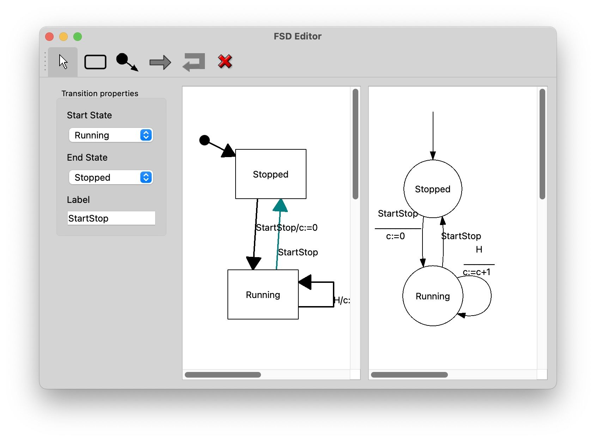
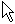

# SSDE 

A **S**imple **S**tate **D**iagram **E**ditor.

## Using

Everything should be rather intuitive..

### Editing 

* To **add a state**, select the  button in the toolbar and click on the
  canvas

* To **add a transition**, select the  button, click on
  the start state and, keeping the mouse button pressed, go the end state and release mouse button.

* To **add a self transition** (from a state to itself) , select the  button
  and click on start state (the location of the click will decide on that of the
  transition).

* To **add an initial transition**, select the  button
  and click on initial state 

* To **delete a state or a transition**, select the  button
  and click on the state or transition (deleting a state will also delete all incoming and
  outcoming transitions)

* To **move a state**, select the  button and drag the state.

* To **edit a state or a transition**, select the  button, click on
  the corresponding item and update the property panel on the right.

### Saving and loading

* The current diagram can be saved by invoking the `Save` or `Save As` action in the `File` menu.

* A saved diagram can be reloaded by invoking the `Open` action in the `File` menu.

* The `New` action in the `File` menu clears the diagram

### Rendering and exporting

* The current diagram can be rendered using the [DOT](http://www.graphviz.org) engine invoking the
  `Render DOT` action in the `Dot` menu.
* The current diagram can be exported to [DOT](http://www.graphviz.org) format by invoking the `Export`
  action in the `Export` menu.

**Note**. In-app DOT rendering uses the [QGV](https://github.com/nbergont/qgv/) library which,
itself, relies on the `graphviz` library. Both libraries have limitations -- wrt. the DOT language
-- which sometimes make rendering a bit crude. For best results, export the diagram to DOT format and
view it using the `graphviz` application. 

## INSTALLATION

Prebuilt Windows and MacOS versions can be downloaded [here](https://github.com/jserot/ssde/releases/tag/v0.3)

See the `INSTALL` file to build from sources.

### Credits

The initial project was inspired by some code written by A. Deterne and L. Malka.

The project uses the [QGV](https://github.com/nbergont/qgv) library, which is no longer supported,
with some minor modifications and bug fixes. 

### Links

For a more sophisticated state diagram editor, see the
[rfsm-light](https://github.com/jserot/rfsm-light) project.
